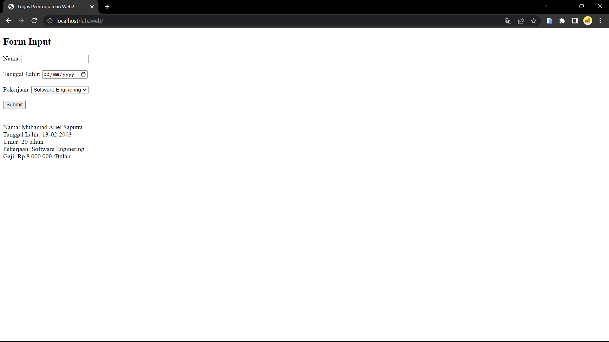

# Tugas Program From Pekerjaan

## form pekerja

- Output Web
  

- Syntax di bawah adalah sebuah formulir HTML dengan tiga elemen input yaitu Nama, Tanggal Lahir, dan Pekerjaan, dan sebuah tombol Submit.
  ```
  <h2>Form Input</h2>
    <form method="post">
        <label for="nama">Nama:</label>
        <input type="text" id="nama" name="nama"><br><br>
        <label for="tgl_lahir">Tanggal Lahir:</label>
        <input type="date" id="tgl_lahir" name="tgl_lahir"><br><br>
        <label for="pekerjaan">Pekerjaan:</label>
        <select id="pekerjaan" name="pekerjaan">
            <option value="Software Enginering">Software Enginering</option>
            <option value="Web Development">Web Development</option>
            <option value="Data Analyst">Data Analyst</option>
        </select><br><br>
        <input type="submit" value="Submit">
    </form>
  ```
  

- Syntax di bawah adalah kode PHP yang digunakan untuk mengambil nilai dari input form yang telah dikirim oleh pengguna setelah tombol submit ditekan.

```
//ambil nilai dari input form
    $nama = $_POST["nama"]; 
    $tgl_lahir = $_POST["tgl_lahir"];
    $pekerjaan = $_POST["pekerjaan"]; 
    
```
 

- Syntax di bawah adalah kode PHP yang digunakan untuk menghitung umur seseorang berdasarkan tanggal lahir yang telah diisi oleh pengguna pada formulir input sebelumnya.


  ```
  // hitung umur berdasarkan tanggal lahir
    $today = new DateTime();
    $birthdate = new DateTime($tgl_lahir);
    $umur = $today->diff($birthdate)->y;
    $tanggal_lahir_baru = date("d-m-Y", strtotime($tgl_lahir)); // mengubah format tanggal lahir

  ```

- Syntax di bawah adalah kode PHP yang digunakan untuk menentukan gaji berdasarkan pekerjaan yang diisi oleh pengguna pada form input sebelumnya.

  ```php
  // tentukan gaji berdasarkan pekerjaan
    if ($pekerjaan == "Software Enginering") {
        $gaji = 8000000;
    } else if ($pekerjaan == "Web Development") {
        $gaji = 12000000;
    } else if ($pekerjaan == "Data Analyst") {
        $gaji = 10000000;
    }

  ```

- Syntax di bawah adalah kode PHP yang digunakan untuk menampilkan hasil dari data yang diinputkan oleh pengguna pada form sebelumnya, termasuk umur, gaji, dan informasi pekerjaan.

  ```php
  // tampilkan hasil
    echo "Nama: " . $nama . "<br>";
    echo "Tanggal Lahir: " . $tanggal_lahir_baru . "<br>";
    echo "Umur: " . $umur . " tahun<br>";
    echo "Pekerjaan: " . $pekerjaan . "<br>";
    echo "Gaji: Rp " . number_format($gaji, 0, ".", ".") . " /Bulan", "<br>";

  ```

